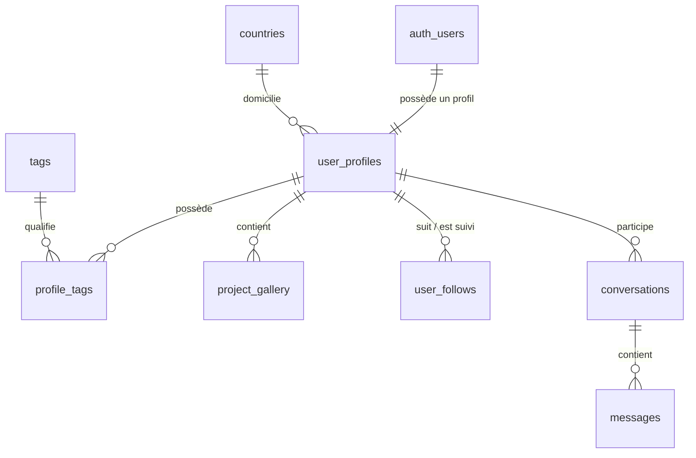

/**
 * @author @hopsyder
 * @organization Nexus Partners
 * @description DATABASE DOCUMENTATION - Schema & Security (SSoT) pour EmiID
 * @version 1.3.0
 * @updated 2026-06-11
 * 🌐 ceo.nexuspartners.xyz
 * 📧 daoudaabassichristian@gmail.com
 * ──────────────────────────────────
 */

# 🗄️ Database — EmiID Master Schema

La base de données repose sur **PostgreSQL (via Supabase)**. Le fichier de migration SQL et le fichier `database.types.ts` servent de références pour le schéma de données.

---

## 🏗️ Modèle Conceptuel de Données (MCD)

Le diagramme suivant représente les entités clés de la base de données EmiID et leurs relations :

---

## 📋 Description Détaillée des Tables

### 1. Référentiels Géographiques et Professionnels

#### 🌍 Pays (`countries`)
Stocke les pays acceptés avec un focus sur l'intégration régionale en Afrique de l'Ouest.
- `id` : UUID (Primary Key)
- `name` : VARCHAR(100) — Nom complet du pays
- `iso_code` : CHAR(2) (Unique) — Code ISO standard (ex: 'CI', 'ML', 'FR')
- `is_west_africa` : BOOLEAN (Default: false) — Indicateur de pays de la CEDEAO (XOF)
- `created_at` : TIMESTAMPTZ

#### 🏷️ Tags (`tags`)
Tableau des mots-clés et compétences associables aux profils.
- `id` : UUID (Primary Key)
- `name` : VARCHAR(100) (Unique) — Libellé du tag (ex: 'React', 'Plomberie')
- `created_at` : TIMESTAMPTZ

#### 🔗 Table de liaison : Tags des Profils (`profile_tags`)
Assure la relation Many-to-Many entre les profils et leurs compétences.
- `profile_id` : UUID (Foreign Key -> `user_profiles.id` ON DELETE CASCADE)
- `tag_id` : UUID (Foreign Key -> `tags.id` ON DELETE CASCADE)
- *Primary Key* : Composite (`profile_id`, `tag_id`)

---

### 2. Cœur : Profils et Portfolio

#### 👤 Profils Utilisateurs (`user_profiles`)
Stocke les métadonnées et paramètres professionnels liés au compte utilisateur Supabase.
- `id` : UUID (Primary Key)
- `user_id` : UUID (Foreign Key -> `auth.users`) (Unique)
- `first_name` : VARCHAR(100) — Prénom
- `last_name` : VARCHAR(100) — Nom de famille
- `email` : VARCHAR(255) — Adresse email de contact pro
- `avatar_url` : TEXT — Lien vers l'image de profil (Supabase Storage)
- `bio` : TEXT — Biographie professionnelle
- `category` : VARCHAR(50) — Type d'activité (Artisan, Freelance, Entreprise, ONG)
- `role` : VARCHAR(100) — Titre ou fonction actuelle
- `specialty` : VARCHAR(255) — Spécialité ou proposition de valeur
- `activity_domain` : VARCHAR(100) — Secteur d'activité principal
- `country_id` : UUID (Foreign Key -> `countries.id`)
- `city` : VARCHAR(100) — Ville de résidence
- `phone` : VARCHAR(50) — Numéro de téléphone de contact
- `phone_verified` : BOOLEAN (Default: false) — Indicateur de vérification OTP
- `website` : VARCHAR(255) — Site web externe
- `slug` : VARCHAR(100) (Unique) — URL publique personnalisée (ex: 'daouda-abassi')
- `pin_enabled` : BOOLEAN (Default: false) — Activation du code PIN de verrouillage
- `pin_code` : VARCHAR(255) — Code PIN haché
- `pin_attempts` : INT (Default: 0) — Nombre de tentatives échouées de PIN
- `is_locked` : BOOLEAN (Default: false) — Compte verrouillé temporairement (PIN)
- `locked_at` : TIMESTAMPTZ — Date de verrouillage
- `is_published` : BOOLEAN (Default: false) — Profil visible dans l'annuaire public
- `is_verified` : BOOLEAN (Default: false) — Badge de confiance accordé par l'admin
- `is_premium` : BOOLEAN (Default: false) — Statut d'abonnement payant
- `card_variant` : VARCHAR(50) (Default: 'default') — Style d'affichage (ex: 'glass-blue')
- `has_profile` : BOOLEAN (Default: false) — Indique si l'utilisateur a fini son onboarding
- `followers_count` : INT (Default: 0) — Nombre d'abonnés
- `created_at` : TIMESTAMPTZ
- `updated_at` : TIMESTAMPTZ

#### 🖼️ Galerie de Réalisations (`project_gallery`)
Contient les réalisations et le portfolio associés à un profil.
- `id` : UUID (Primary Key)
- `user_id` : UUID (Foreign Key -> `auth.users`)
- `profile_id` : UUID (Foreign Key -> `user_profiles.id` ON DELETE CASCADE)
- `title` : VARCHAR(255) — Titre du projet
- `description` : TEXT — Description du projet
- `image_url` : TEXT — Lien du média dans le stockage d'images
- `order_index` : INT (Default: 0) — Index de tri pour l'affichage de la galerie
- `status` : VARCHAR(50) (Default: 'pending') — État de validation ('pending', 'approved', 'rejected')
- `created_at` : TIMESTAMPTZ
- `updated_at` : TIMESTAMPTZ

---

### 3. Réseautage & Interactions

#### 🤝 Abonnements (`user_follows`)
Gère les relations de follow entre profils.
- `id` : UUID (Primary Key)
- `follower_id` : UUID (Foreign Key -> `user_profiles.id` ON DELETE CASCADE) — L'utilisateur qui s'abonne
- `following_id` : UUID (Foreign Key -> `user_profiles.id` ON DELETE CASCADE) — L'utilisateur suivi
- `notes` : TEXT — Notes privées sur le contact
- `created_at` : TIMESTAMPTZ

#### 💬 Conversations (`conversations`)
Entité de liaison pour la messagerie instantanée.
- `id` : UUID (Primary Key)
- `participant1_id` : UUID (Foreign Key -> `auth.users`)
- `participant2_id` : UUID (Foreign Key -> `auth.users`)
- `last_message_content` : TEXT — Aperçu du dernier message
- `last_message_at` : TIMESTAMPTZ — Horodatage pour trier la liste de discussions
- `created_at` : TIMESTAMPTZ

#### ✉️ Messages (`messages`)
Contient les messages individuels des conversations.
- `id` : UUID (Primary Key)
- `conversation_id` : UUID (Foreign Key -> `conversations.id` ON DELETE CASCADE)
- `sender_id` : UUID (Foreign Key -> `auth.users`)
- `content` : TEXT — Contenu du message (chiffré/sanitizé)
- `is_read` : BOOLEAN (Default: false) — État de lecture
- `created_at` : TIMESTAMPTZ

---

## 🛡️ Sécurité (Row Level Security - RLS)

Supabase RLS applique des restrictions d'accès directement dans PostgreSQL :

- **Profils (`user_profiles`)** :
  - **SELECT** : Accessible publiquement uniquement si `is_published = true`. Toujours accessible par le propriétaire.
  - **INSERT/UPDATE** : Autorisé uniquement si `auth.uid() = user_id`.
- **Galerie (`project_gallery`)** :
  - **SELECT** : Accessible publiquement si le statut est `'approved'`. Toujours accessible en lecture/écriture par le propriétaire.
- **Messagerie (`conversations` et `messages`)** :
  - **ALL** : Accès restreint uniquement aux utilisateurs qui sont enregistrés comme `participant1_id` ou `participant2_id` de la conversation associée.

---

## ⚙️ Fonctions et Déclencheurs SQL (Triggers)

1.  **`handle_new_user()`** : Déclenché après chaque `INSERT` dans la table `auth.users` de Supabase. Il crée automatiquement un profil vierge dans `user_profiles` avec les champs d'identité de base et `has_profile = false`.
2.  **`sync_followers_count()`** : Déclenché lors d'un `INSERT` ou `DELETE` dans `user_follows`. Il recalcule et met à jour automatiquement la colonne `followers_count` de la table `user_profiles`.

---

## 👁️ Vues de Base de Données

#### `public_profiles`
Vue publique sécurisée évitant l'exposition des données sensibles (comme le hachage du code PIN) et ne listant que les profils ayant activé l'option de publication (`is_published = true`).

---

## 🚀 Recommandations de Maintenance
> [!IMPORTANT]
> - Toute modification de structure de base de données doit être déclarée via un fichier de migration SQL dans le dossier `sql/` et répercutée dans `database.types.ts`.
> - N'utilisez **JAMAIS** le rôle `service_role` de Supabase en dehors des scripts d'administration et des Server Actions sécurisées (dans `frontend-admin`) afin d'éviter tout contournement accidentel des règles RLS.
