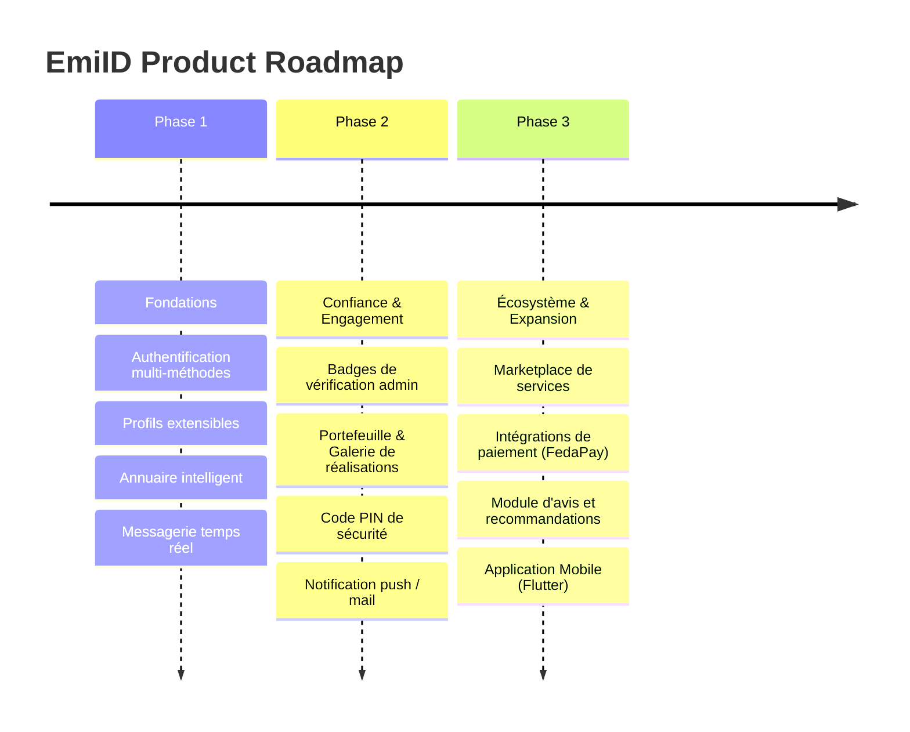
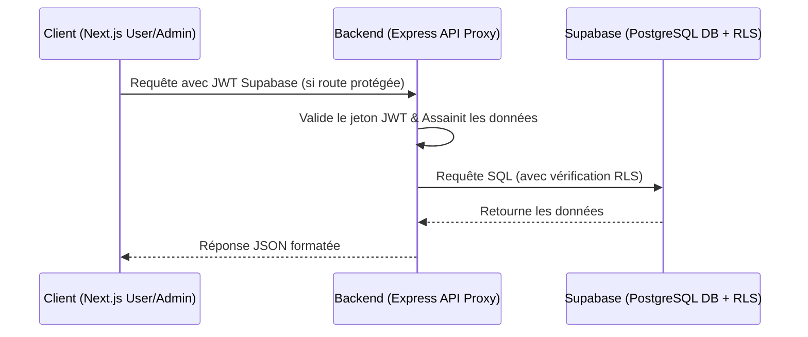

/**
 * @author @hopsyder
 * @organization Nexus Partners
 * @description PROJECT OVERVIEW - Vision, Architecture, Stratégie & Évolutions pour EmiID
 * @version 1.4.0
 * @updated 2026-07-13
 * 🌐 ceo.nexuspartners.xyz
 * 📧 daoudaabassichristian@gmail.com
 * ──────────────────────────────────
 */

# 🌌 EmiID — Project Overview

EmiID est une **infrastructure de confiance** pour l'écosystème professionnel, conçue pour transformer les interactions informelles en opportunités vérifiables et qualifiées, avec un focus initial sur l'Afrique de l'Ouest.

---

## 🎯 Vision & Problématique Résolue

### Problématique
EmiID répond au besoin de structuration et de visibilité de l'écosystème professionnel en Afrique. La plateforme résout le problème de la fragmentation des talents et de la difficulté à trouver des prestataires de confiance via une plateforme centralisée, interactive et vérifiée.

### Cible Utilisateur & Cas d'Usage
- **Indépendants / Artisans** : En quête de clients et d'une vitrine numérique crédible.
- **Professionnels / Experts** : Réseautage stratégique et gestion de carrière.
- **Entreprises / Organisations** : Recrutement local, vérification de conformité, et visibilité institutionnelle.
- **Administrateurs** : Modération des contenus, gestion des litiges, et suivi des statistiques économiques de la plateforme.

---

## 🚀 Perspective Produit & Roadmap

### Roadmap de Développement

#### Phase 1 : Fondations (Complété)
- [x] Authentification multi-méthodes (Email, OTP).
- [x] Système de profils extensibles avec gestion dynamique de l'onboarding.
- [x] Annuaire intelligent avec filtres géographiques et par mots-clés.
- [x] Messagerie temps réel avec indicateurs de lecture.

#### Phase 2 : Confiance & Engagement (En cours)
- [x] Modération admin pour les réalisations du portfolio.
- [x] Intégration de la galerie Bento dans le profil public.
- [x] Sécurisation par code PIN et double authentification OTP.
- [ ] Notifications transactionnelles (finalisation SMTP).

#### Phase 3 : Écosystème & Expansion (Futur)
- [ ] Intégration de passerelles de paiement locales en Afrique de l'Ouest (**FedaPay** MTN/Moov/Orange Money en XOF, Stripe à l'international).
- [ ] Système d'avis et de recommandations entre membres pour consolider la confiance.
- [ ] Application mobile multiplateforme (**Flutter**) reposant sur les API existantes.

---

## 🏗️ Architecture Technique

### Stack Technologique du Monorepo
- **Frontend User** : Next.js 15 (App Router), React 19, Lucide, Framer Motion, Tailwind CSS.
- **Frontend Admin** : Next.js 16 (App Router expérimental), Tailwind CSS 4.
- **Backend API Proxy** : Node.js, Express, TypeScript.
- **Base de Données & Services** : Supabase (PostgreSQL, Realtime, Storage, Auth).

### Flux de Fonctionnement des Données

---

## 🔐 Authentification & Sécurité

- **Supabase SSR** : Gestion sécurisée des cookies de session côté serveur pour éliminer les failles CSRF/XSS.
- **Sécurité RLS (Row Level Security)** : Implémentation directe au niveau PostgreSQL des règles d'accès aux tables privées (messages, configurations de profils non publiés).
- **Protection par code PIN** : Couche supplémentaire de sécurité intégrée au profil de l'utilisateur pour le déverrouillage de données sensibles.
- **Bypass Admin contrôlé** : Toutes les opérations privilégiées côté admin s'exécutent via des Server Actions qui vérifient le rôle `admin` de l'utilisateur avant d'exploiter la clé `service_role` de Supabase.

---

## 📦 Améliorations Futures Majeures

1.  **Paiement Intégré** : Développement du portefeuille d'affaires (`portefeuille`) utilisant des intégrations API locales avec FedaPay et Stripe pour simplifier le paiement mobile money en Afrique de l'Ouest.
2.  **Taxonomie Améliorée** : Évolution de la taxonomie des métiers en reliant dynamiquement les compétences (`tags`) aux secteurs professionnels prédéfinis.
3.  **Audit Logs (Complété)** : Suivi rigoureux de l'activité des administrateurs et modérateurs dans la table `admin_audit_log` pour garantir la transparence des actions de signalement, de suspension de profils et de résolution de litiges.
