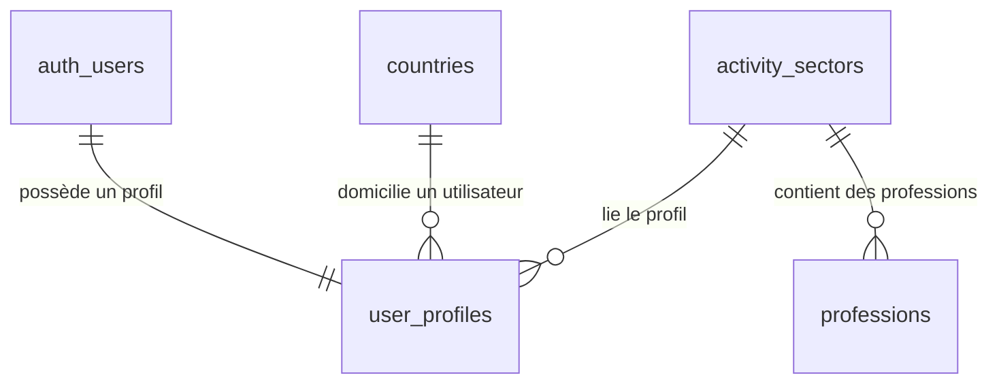

/**
 * @author @hopsyder
 * @organization Nexus Partners
 * @description Modèles de données (Schéma SQL) pour Nukun
 * @created 2026-03-24
 * @updated 2026-04-19
 * 🌐 ceo.nexuspartners.xyz
 * 📧 daoudaabassichristian@gmail.com
*/──────────────────────────────────

# 💾 Modèles de Données - Nukun

Ce document présente les modèles de données fondamentaux du projet, leurs relations et leurs contraintes techniques.

## 1. Référencement Géo-Professionnel

### 🌍 Pays (`countries`)
Table stockant les informations géographiques avec focus sur l'Afrique de l'Ouest.
- `id` : UUID (Primary Key)
- `name` : VARCHAR (100) - Libellé du pays
- `iso_code` : CHAR (2) (Unique) - ex. 'ML', 'FR'
- `is_west_africa` : BOOLEAN (Default: False) - Flag régional
- `created_at` : TIMESTAMPTZ

### 🏗️ Secteurs d'Activité (`activity_sectors`)
- `id` : UUID (Primary Key)
- `name` : VARCHAR (100)
- `slug` : VARCHAR (100) (Unique) - ex. 'tech-digital'
- `created_at` : TIMESTAMPTZ

### 🧑‍💼 Professions (`professions`)
Relie les professions à un secteur spécifique.
- `id` : UUID (Primary Key)
- `sector_id` : UUID (Foreign Key -> `activity_sectors`)
- `name` : VARCHAR (100)
- `created_at` : TIMESTAMPTZ

---

## 2. Utilisateurs & Profils

### 👤 Profils Utilisateurs (`user_profiles`)
L'entité centrale liée à l'authentification Supabase.
- `id` : UUID (Primary Key)
- `user_id` : UUID (Foreign Key -> `auth.users`) (Unique)
- `first_name` : VARCHAR (100)
- `last_name` : VARCHAR (100)
- `email` : VARCHAR (255)
- `avatar_url` : TEXT
- `bio` : TEXT
- `category` : VARCHAR (50) - (Artisan, Freelance, Entreprise, ONG)
- `role` : VARCHAR (100) - Titre pro
- `specialty` : VARCHAR (255) - Description détaillée
- `activity_domain` : VARCHAR (100)
- `country_id` : UUID (Foreign Key -> `countries`)
- `city` : VARCHAR (100)
- `has_profile` : BOOLEAN (Default: False) - Flag de complétion
- `created_at` : TIMESTAMPTZ
- `updated_at` : TIMESTAMPTZ

---

## 🔗 Relations Principales (Diagramme Logique)

## 🔐 Logique de Sécurité (RLS)

- **Profils** : Consultables par tous (`SELECT true`), modifiables uniquement par le propriétaire (`auth.uid() = user_id`).
- **Référentiels** : Lecture publique, écriture réservée (Admin uniquement via politiques non incluses ici).
